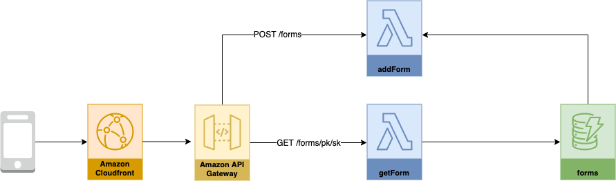

# Design

Forms Engine is a horizontal component.  Survey is the first client.

Edit diagram by importing diagram to  https://app.diagrams.net/

## Table forms

|Name|Values|Description|
|--|--|--|
|pk|Slug ID / Form Name| **Primary Key**|
|sk|form / named-form| **Sort Key**|
|form|JSON form definition||
|createdDate|Created Date Time||
|updatedDate|Updated Date Time||

### Custom additions by Surveys

|Name|Values|Description|
|--|--|--|
|category1|employee / visitor||
|category2|Form Name||
|country|Country for which the survey is for||
|mandatedDays|Number of days mandated for filling the survey before a badge can be issued||
|surveyLink|Survey Link|location int he Visitor Survey Link is for illustrative purposes only|

## Technology

| Concern | Technology|Description|
|--|--|--|
|Web UI|React, CloudFront|Progressive Web App|
|API|AWS Gateway|Open API Spec|
|Business Logic|Python|AWS Lambda|
|Coded Deployment|AWS Code Pipeline, AWS Code Build, AWS Cloud Formation |
